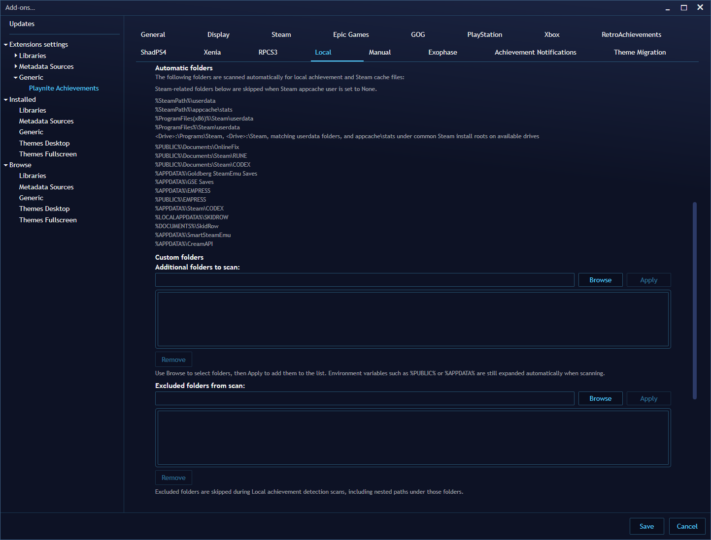
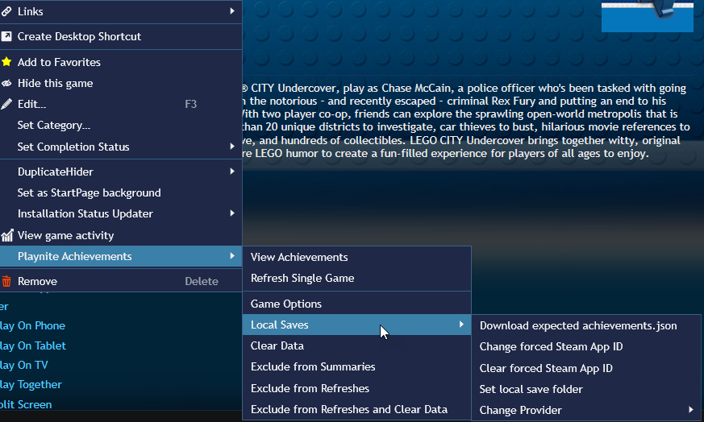
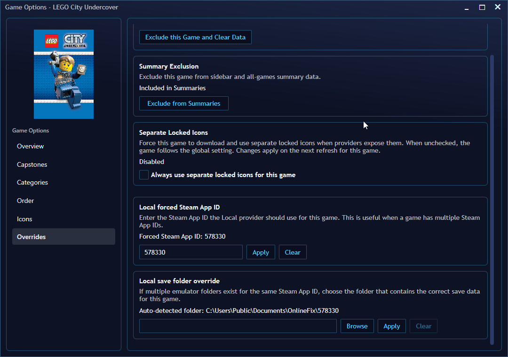
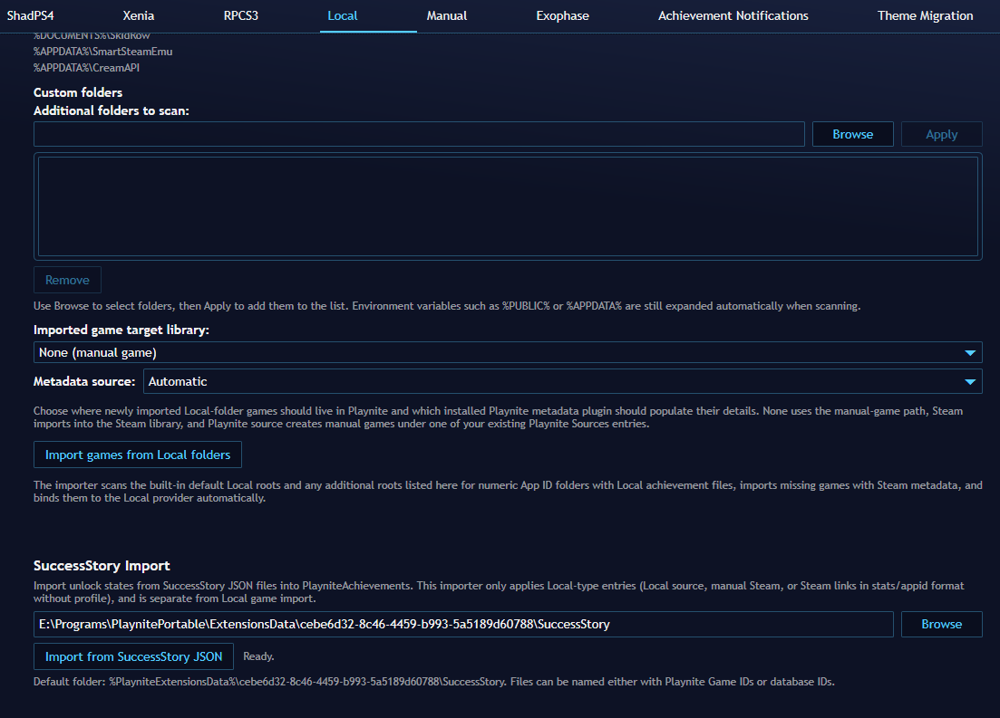
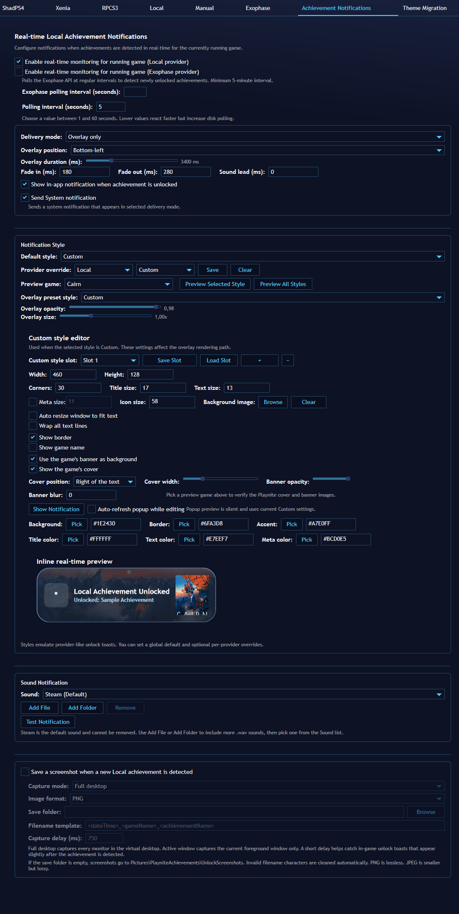
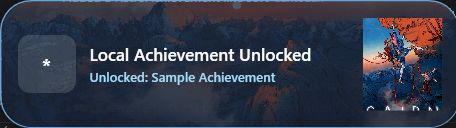
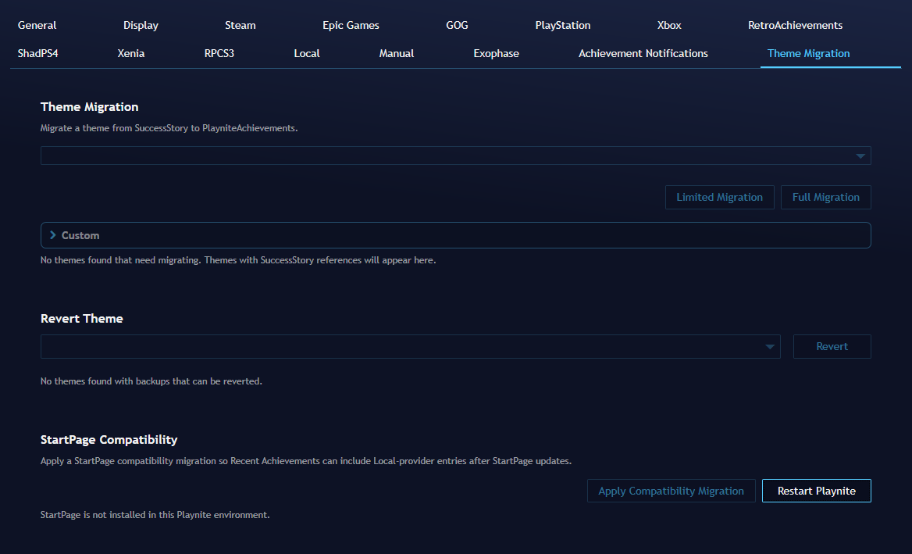

  

<h1 align="center">Playnite Achievements - Santodan Fork</h1>

> Official documentation for the base project should be taken from the original repository.
>
> - Original repository: https://github.com/justin-delano/PlayniteAchievements
> - Official wiki / documentation: https://github.com/justin-delano/PlayniteAchievements/wiki
> - Official releases: https://github.com/justin-delano/PlayniteAchievements/releases
> ## Quick Notes For Users Of This Fork
>
>- If you need setup instructions for Steam, GOG, Epic, RetroAchievements, PSN, Xbox, RPCS3, ShadPS4, Xenia, or Exophase, use the upstream wiki first.
>- If you are using this fork specifically for Local support, the main differences are the Local provider, Local overrides, Local compatibility fixes, and Local-focused refresh / notification work listed above.
>
>
> I'm not a developer, I'm a troubleshooting guy, so everything is made with LLM

# What This Fork Focuses On

- Local save support and local achievement
- No need for a steam account to gather the achievements schema
  - There is the option to select between Steam ( API ), SteamHunters and Completionist.me
- Compatibility work for non-standard Steam and local setups
  - If you are using Steam local saves ( GreenLuma or SteamTools, for example) the game will be detected as been from steam, you will need to override the provider to Local
- Per-game Local overrides inside Game Options
- Faster access to saved refresh presets from the main sidebar refresh selector
- Local-only realtime monitoring and notification improvements
- Add all the local achievements' games with the corresponding metadata
- Local Achievement Notification
- `SuccessStory` Import
- Theme and `StartPage` migration

Guides available in [Achievement Notifications Guide](ACHIEVEMENT_NOTIFICATIONS_GUIDE.md) and [Local Provider Troubleshooting](LOCAL_PROVIDER_TROUBLESHOOTING.md)

## Local Provider Folder List And Browse Flow

You can set any custom folder where you have saves located in your system as exception to never detect achievements from it

## Local Game Options Overrides

If you Right-click the game it will show a quicker way to do these changes:

From the PlayniteAchievements menu inside the game

## Local Achievements' Games import and `SuccessStory Import`

This is a way of adding all of those achievements that are in the folders ina  way that it isn't needed to go through the folders and adding one by one.

There is also the option to import data from `SuccessStory`. This will go through all the JSON files in the selected SuccessStory folder and import the `Local` games and also the achievements for the games that were detected in them.

## Local Achievement Notification

This was a request from a user to have a sound playing when an achievement is unlocked while playing a game. 
Extra sounds in the [Resources/AdditionalSounds](source/Resources/AdditionalSounds) 
A notification for when the game that is been played has a new achievement unlocked. 
You can customize the overlay or use one of the provided themes. 
You can enable / disable the `Achievement Notification` in the right click  menu for each game.

## `StartPage` and Themes compatibility

In the `Theme Migration` tab you will have the possibility to make theme compatible with this fork, and that's also for theme that already support the original PlayniteAchievements fork, they still need to go through the `Theme Migration` since they are point to the other repo and not this one

There is also the `StartPage Compatibility` so the `Local` achievements appear in the `StartPage` extension when `PlayniteAchievements` is selected

# Fork Changelog

The entries below are fork-side changes, grouped by date. When a date includes an upstream sync, only the fork-specific additions are called out here.

## Next release - TBD

- Fixed `RetroAchievements Game ID Override` displaying `No override set` after setting an override
- Removed `Display Order` column since the third click feature sorts with the correct RA order
- Restored the third click in the header to remove the column sort
- Fixed an error in the WebView2 warm-up window
- Fixed an issue where the `Achievement Notification` wasn't trigger any custom setting
- Fixed the first click in the column header is always ascending, the second descending and the third removes the sort

## 2026-07-20 - v2.5.3.3
- Trying to make the WebView notification quicker
- Fixed a duplicate playnite window in the `ALT+TAB` menu in windows
- Removed duplicated variables in the `Achievement Notification`
- Moved `Sound lead` to the sound part
- Removed the limit in the `Sound lead`, it can now accept negative values
- Added notification for `Prestige` and `Collection` level up and tier up
- Added wildcards to the `Save Folder` for the `Achievement Notification` screenshot
- Fixed `Auto resize window to fit text` not working with SAN elements / transitions
- Fixed the screenshot feature nto working with the `API Verification` for `exophase` and `RetroAchievements`
- Fixed the `Remove current slot` size and strange characters
- Fixed the san template remaining active when changed back to the "normal" notifications
- Added `Corners` setting for the icons
- Added `Preview Achievement` next to the `Preview Game`
- Fixed the square shadow when using corners in the notification
- Fixed the screenshot feature taking effect when enabled and the real-time notification been disabled
- Fixed the `Provider Override` not been properly set
- Fixed the `Clear` in the `Manage Achievement` not clearing the `Provider Override`
- Pressing the multiple folders notification will take you to the folder selection page
- Added a setting to have the overlay in the same monitor as the game for multiple monitors
- Fixed the notification not showing the achievement's icon when offline
- Guides added to the github

## 2026-07-09 - v2.5.3.2
- Fixed the multiple folders detection showing the list index instead of the folder path
- Fixed missing `Prestige Score` and `Collection Score` when using `SteamHunters` to fetch the schema
- Fixed `LumaPlay` refreshing without a `LumaPlay.ini` override setting been set
- Fixed the extension trying to fetch achievement for `New Game` when pressing to add a new manual game to the library
- Fixed freeze when `Custom Refresh` checks the authentications
- Fixed missing providers inside the `Overrides` -> `Local` -> `Change Providers`
- Changed the `Real-time monitoring` logs to only be generated every 10 minutes or in case of error
- Fixed some icons missing from schemas from Steam
- Fixed schema fetch not been done through steam when authenticated
- Added support for achievements with a progress bar
- Added the option to refresh the game's achievements when the real time notification is triggered
- Fixed fullscreen themes showing `Unknown` instead of `Local` provider in the achievements
- Added `RetroAchievement` to `Achievement Notification`
 - It might trigger some rate-limit since it is through API
- `Achievement notification` reimagined (`SAN-Integration` branch merged)
  - You can see the changelog in https://github.com/Santodan/PlayniteAchievements/issues/5#issuecomment-4877909986

## 2026-06-22 - v2.5.3.1
- v2.5.2 + v2.5.3 merge
- Fixed the missing `Collection Score`, `Prestige Score` and `Points` columns from the `Game Summary` tab
- Fixed the tooltip when hovering the `Prestige Score` and the `Collection Score` is not been the same as it is in the main fork
- Fixed the main extension page not saving the filters when exiting the page
- Fixed the locked achievements not been greyed out when doing the theme migrations without the scrollable option enabled.
- Fixed the sort for the `Selected Game` in the `Custom (Manual)` menu not saving correctly
- Fixed the stuttering when using the `Game Overview` global hotkey
- Fixed the missing tooltip menu for the `Prestige Score` and the `Collection Score`
- Fixed the wrong placement for the level and points in `Prestige Score` and the `Collection Score`
- Added support for achievement with progress bar

## Old Changelogs

## 2026-06-18 - v2.5.1.1
- v2.5.1 merge
- Fixed `RetroAchievement` sort
- Fixed missing the `DisplayOrder` to confirm the `RetroAchievement` order
- Fixed `Prestige Score` showing wrong values on startup
- Fixed missing tooltip from `Collection Score` and `Prestige Score`
- Fixed the missing right click options in the `Game Summary`
- Fixed the locked achievements have the same icon
- Fixed the Achievements rarity not been filled when there is no achievement file

## 2026-06-16 - v2.5.0.1
- v2.5.0 merge
- Possibility to change to `Manual` from inside the `Overrides`
- Correct string in the `Provider` inside the `Override` menu when set to something different than `Automatic`
- `Manual Tracking` will not appear when a `Provider` has been set besides `Automatic` and `Manual`
- Fix the `Achievement Notification` was not respecting the excluded setting
- The `Collection Score` and `Prestige Score` always appear the bronze and then it refreshes to the actual value
- Fixed the `Refresh this game when it closes` that was not possible to enable per game when the global setting was disabled
- Fixed the wrong notification template appearing when the refresh pool detected more than one achievement

## 2026-06-03 - v2.4.0.1

- v2.4.0 merge
- Fixed the `Manual Tracking` not fetching schemas
- Added the option for a scrollable area in the `Theme Migration` maintaining the original fork option

## 2026-05-31 - v2.3.0.1

- v2.3.0 merge
- Added <rarityIcon> to the `Achievement Notification`
- Added stackable notification like in Steam
- Hopefully, fixed the settings reset issue

## 2026-05-29 - v2.2.0.1

- v2.2.0 merge
- `Custom Schema` always visible
- Fixed `Clear Data` not removing the `Custom Schema`
- Added `Custom Schema` enabled / disabled option
- Added the possibility to create the `Custom Schema` directly form the extension
- Added the option of fetching the icon from `View Achievements` when there is no icon in the `Custom Schema` JSON
- Added the option of setting a `Default` icon in the `Custom Schema`, in the `Icon` tab, that will be set for all the achievements that don't have an icon in the JSON.
- Added more customizations to the `Achievement Notification`
- Added a template builder to create a JSON file that can be imported as the notification template
- Workaround for the reset of the configurations
- `Platform` filter also applies to `All Achievements` tab
- Added support to `TENOKE` achievements
- `Custom Schema` will now take priority over online schema when enabled

## 2026-05-21 - v2.1.5.1

- v2.1.5 merge
- Fixed local `Steam` achievements ( part 99 )
- Added the possibility to have a more than one steam account for achievements
  - It is only possible through API for the additional accounts
- Fixed some `LumaPlay` compatibility bugs
- Fixed `OnlineFix` games wrong achievement detection
- Fixed some missing `Theme Migration` compatibility
- Fixes the duplicated achievements in the `SuccessStory` import
- Added the option to overwriting existing achievements when using the `SuccessStory` import
- Added the possibility to exclude sources when using the `SuccessStory` import
- Added the possibility to edit the achievements through the `View Achievements` view in the game options
- Added the possibility to change the `Local` icon to one of the others platforms
- Added the option to refresh the achievements when the game closes
- Added the option to import custom achievements schemas
- Changed the `Overrides` page to separate this fork's options fromthe main fork
- `Change Provider` added to the `Overrides`
- Added a dropdown in the `Local save folder override` when multiple folders are found
- Fixed the issue of no icons when the achievement file has a broken icon path

## 2026-05-09 - v2.1.3.3

- `LumaPLay` achievements integrated
- Import Local `SuccessStory` achievements history
- Fixed local `Steam` achievements ( Hopefully this is the one )
- Fixed Steam path auto-detect
- Added the option of showing the game's banner and cover in the `Achievement Notification`
- Added exception folders list to the `Local` tab to never get achievements from it

## 2026-05-05 - v2.1.3.2

- Fixed the `Local` achievements not respecting the language setting
  - Added an API token fetch or manual insert for the hidden achievements
- Fixed the extension not clearing the `Steam` authentication
- Added `SteamGridDB` as a icon fetcher for `SteamHunters` and `Completionist` metadata providers
  - If no icon found, will add the cover image as icon
- The `Automatic` metadata fetch will not attempt the correct order:
  - Universal Steam Metadata
  - Steamhunters
  - Completionest.me
  - IGDB
- Add more settings to the overlay notification
- Fixed the `Theme Migration`
- Add `Custom (Manual)` option for the `Default Achievement Sort`
- Add the `Default Achievement Sort` to the main page for a quicker change of sort order
- Sorting by the `Icon` will sort with `RetroAchievement` order
- Added a `StartPage` section in the `Theme Migration` to make it compatibile with the `Local` provider

## 2026-05-01 - v2.1.3.1

- Merge from original v2.1.3 - https://github.com/justin-delano/PlayniteAchievements/releases/tag/v2.1.3
- The default icon will now appear in the `Local` under the `Local provider Icon` when no custom icon was selected
- Corrected some sentence and button sizes in the `Achievement Notification` tab
- Fix the renaming a slot in the `Achievement Notification` custom style not saving
- Fix some settings not been saved in the `Achievement Notification`
- Changed the list of custom style in `Achievement Notification` to only show the saved slots
  - You will have a big list in the dropdown which you can delete and maintain only the one that you want
- Added Exophase to `Achievement Notification`
  - Exophase can apply a rate limit, to be honest, I wouldn't recommend it using it
- Change the default sort on the first click to Descending instead of ascending
  - Text will be A to Z and dates will be newest to latest
- Added the possibility to sort for more than one column by pressing CTRL+MOUSE in the columns
- Added a RetroAchievement like sort
- Correct some UI aligments in the `Local` tab
- Correct an Out Of Memory error when saving the settings
- Added a setting to stop receiving the notificaitons when is detected more than one save location for the game
- Remove the notification for the upstream fork updates
- Fixed the compatibility with the new Aniki-Remake theme
- Fixed the compatibility with the new Solaris theme
- Fixed the compatibility with the Toggle theme
- Fixed the compatibility with the PS5Reborn theme
- Updated the `Theme Migration` for theme that are pointing for the original fork
- In the `Theme Migration` no more need to revert and apply again the same theme, it will now do that when applying it to a theme that was already migrated

## 2026-04-22 - v2.1.2.2

- Fixed the local steam achievements not having rarity
- Added the option to change the steam user for local steam achivements detection
- Added the option to do take a screenshot when a new achievemnt is unlocked with the `Real-time Local unlock checks`
- Moved `Real-time Local unlock checks` settings to its own setting tab called `Achievements Notification`
- Changed the sound notification settings for the achievement notification
- Added a windows notification for new achievements when using the `Achievement Notification`, this can be a Overlay or Windows notification
  - The overlay notification is fully customizable
- Added the option to disable the `Achivement Notification` for that specific game
- The grid's column width will now maintain their size when moving out and then in the extension's page
- Added a setting in the `Display` tab to have the text in the grid as wrap
- Added an `All Achievements` tab
- Correct the Steam game import importing DLCs to the library addiitonally to the main game
- Changed the method to import steam games to be quicker ( I recommend to use the integrated Playnite Steam extension to get the games )
- Stop detecting all the achievements with the description `Local achievement from Local`

## 2026-04-21 - v2.1.2.1

- Merge from original v2.1.2 - https://github.com/justin-delano/PlayniteAchievements/releases/tag/v2.1.2
- Corrected the compatability with Anaki themes
- Corrected the steam import without API key
- Added the possibility to import Steam family-shared games and achievements
- Corrected the steam import not going through the Universal Steam Metadata when selected
- Added an icon for the `Local` provider and a way of changing to your own icon
- Import achievements metadata even when there is no achievements file locally
- Added a list of target games in the custom refresh
- Added Steam Family Sharing as a separate entry in the custom refresh platform list
- `Local` in the Custom refresh menu will only show games that aren't part of the other selectabled options in the list

### 2026-04-17 - v2.1.1.3

- Added anonymous Steam metadata lookup for the Local provider without requiring Steam API access, including selectable SteamHunters and Completionist.me source priority in Local settings.
- Changed the Steam-mode anonymous fallback flow to prefer SteamHunters first, with Steam Community kept only as a later title-based fallback and old Community-first configs remapped away from that path.
- Improved Local schema matching, hidden-achievement handling, and metadata enrichment for anonymous Steam sources so titles, descriptions, icons, and hidden flags resolve more reliably when public data is available.
- Fixed Local schema fallback order so progress-only Goldberg or GSE `achievements.json` files are no longer mistaken for full schema payloads.
- Removed the need for the steam account to have an API key
- Better refresh performance
- No longer needed the Steam API key for the extension to gather the owned games
- Added setting in the General tab to select the default filter in the main page
- Added the option to import all local games with achievements to the library and get the metadata ( Tested with Steam universal Metadata extension )
- Fixed theme migration

### 2026-04-15 - v2.1.1.2

- Updated the fork release metadata to `v2.1.1.2` so Playnite can notify users about new Santodan fork releases.
- Preserved the fork-specific addon identity so upstream releases no longer appear as direct Playnite extension updates for this fork.
- Fixed a merged dependency regression by restoring the working `protobuf-net 2.4.8` references used by the fork build.
- Fixed custom refresh UI freezes by moving expensive target-estimation work off the UI thread.

### 2026-04-15

- Synced the fork forward to the upstream `v2.1.0` codebase.
- Added near-real-time Local achievement monitoring for the currently running game only, instead of polling the whole library.
- Added Local unlock notifications with sound playback.
- Added bundled Local notification sounds plus a separate custom sound-path override.
- Added a Local test notification action so the configured notification + sound can be tested from settings.
- Set the Local default bundled sound flow to use a bundled fallback instead of requiring a custom path.
- Added quick access to saved custom refresh presets from the main sidebar refresh selector.
- Changed the sidebar refresh selector so presets are grouped under a `Presets` menu entry instead of being mixed into the top-level refresh list.
- Fixed Local-only preset targeting and estimation so Local presets only count games that the Local provider can actually resolve.
- Improved extra custom local-save-folder handling so it works as a list with browse support instead of a single raw path.

### 2026-04-11

- Fixed Local save handling for RUNE and OnlineFix layouts.

### 2026-04-08

- Changed Local behavior so cached Local achievement data is preserved when Steam API access is unavailable instead of trying to refetch everything and losing useful local-state visibility.

### 2026-04-07

- Added GreenLuma / SteamTool compatibility improvements.

### 2026-04-06

- Added per-game Local Steam App ID overrides in Game Options.
- Added per-game Local folder overrides in Game Options.

### 2026-04-01

- Added compatibility with the StartPage extension.
- Updated post-build handling to improve `Toolbox.exe` detection and execution.
- Synced the fork state around the upstream `v2.0.2` release.

### 2026-03-31

- Updated the fork for the upstream `2.0.0` / `2.0.1` transition.
- Renamed and reshaped the old cracked-save workflow into the Local provider flow.
- Added support for showing locked achievements even when `achievements.json` does not exist, as long as Local schema / cache data can still resolve them.
- Updated local extension naming and IDs for the fork.
- Replaced `CrackedSavesProvider` with `LocalSavesProvider`.

### 2026-03-29

- Added initial support for Local saves.
- Cleaned up leftover provider debug-path behavior during the early Local provider work.

## Upstream Docs And Credits

- Upstream project: https://github.com/justin-delano/PlayniteAchievements
- Upstream documentation: https://github.com/justin-delano/PlayniteAchievements/wiki
- Upstream releases: https://github.com/justin-delano/PlayniteAchievements/releases
- Santodan fork: https://github.com/Santodan/PlayniteAchievements

